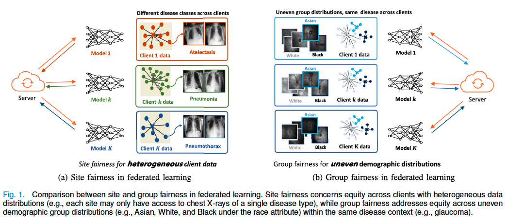
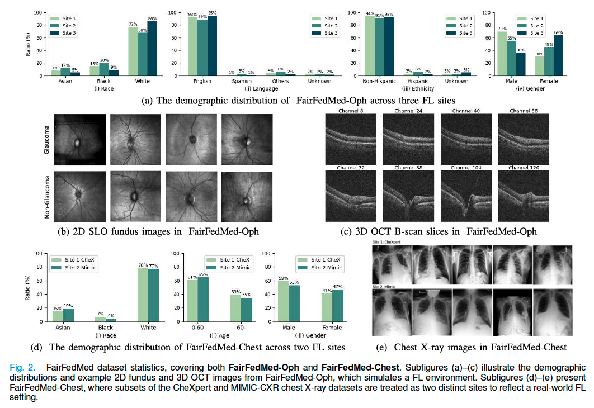
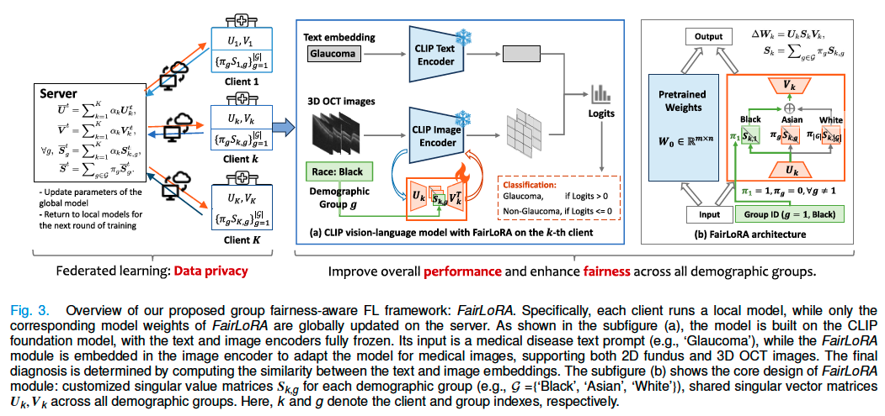
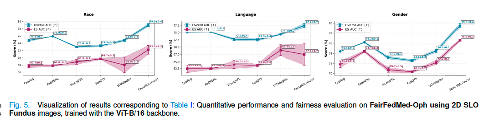
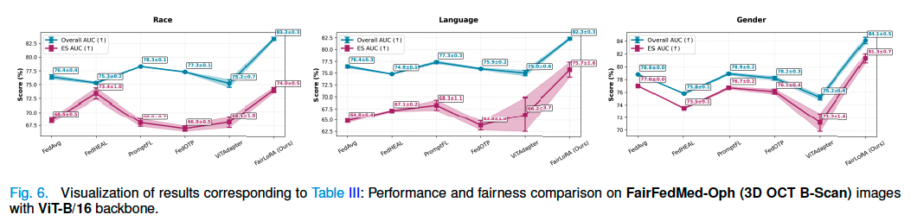
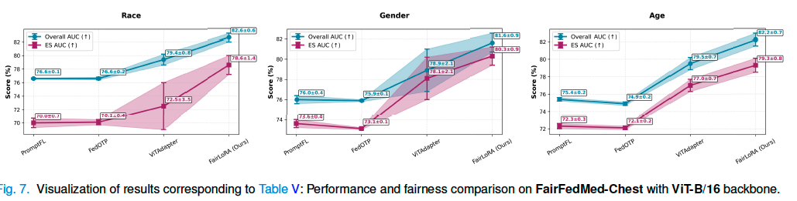

<div align="center">

# FairFedMed: Benchmarking Group Fairness in Federated Medical Imaging with FairLoRA

[](https://ieeexplore.ieee.org/document/11205878)
[](https://arxiv.org/abs/2508.00873)
[](https://drive.google.com/open?id=11SrLJQdKwA3ELEnebTzlmZGadcxnGIiv&usp=drive_fs)

</div>

---

## 🎯 Motivation

<p align="center">
  
</p>

Fairness in medical FL remains underexplored due to heterogeneous data and lack of demographic-aware benchmarks. We introduce:

### 📊 **FairFedMed Dataset**
First medical FL benchmark with demographic annotations
  - **FairFedMed-Oph**: 2D/3D ophthalmology images with 6 demographic attributes
  - **FairFedMed-Chest**: Cross-institutional CheXpert + MIMIC-CXR with 3 attributes

### 🚀 **FairLoRA Framework**
Fairness-aware FL via SVD-based low-rank adaptation
  - Customizes singular values per demographic group
  - Shares singular vectors for efficiency
  - Achieves superior performance-fairness trade-offs

---

## 📦 Dataset

📥 **Download**: [FairFedMed Dataset on Google Drive](https://drive.google.com/open?id=11SrLJQdKwA3ELEnebTzlmZGadcxnGIiv&usp=drive_fs)

### 🏥 FairFedMed-Oph
- **Modalities**: Paired 2D SLO fundus images and 3D OCT B-Scans
- **Scale**: 15,165 patients for glaucoma detection
- **Demographics**: 6 attributes (age, gender, race, ethnicity, preferred language, marital status)

### 🫁 FairFedMed-Chest
- **Sources**: [CheXpert](https://stanfordmlgroup.github.io/competitions/chexpert/) + [MIMIC-CXR](https://physionet.org/content/mimic-cxr/2.1.0/)
- **Setup**: 2 clients simulating real cross-institutional FL
- **Demographics**: 3 attributes (age, gender, race)

### 📊 Dataset Statistics
<p align="center">
  
</p>

### 🗂️ Data Structure
```json
DATA/
  ├── fairfedmed/
  │   ├── all  # a dir that stores all raw data files
  │   │   ├──filename1.npz 
  │   │   ├──filename2.npz 
  │   │   └── ...
  │   ├── meta_all.csv
  │   ├── meta_site{k}_language_train.csv
  │   ├── meta_site{k}_language_test.csv
  │   ├── meta_site{k}_language.csv
  │   ├── meta_site{k}_race_train.csv
  │   ├── meta_site{k}_race_test.csv
  │   ├── meta_site{k}_race.csv
  │   ├── meta_site{k}_ethnicity_train.csv
  │   ├── meta_site{k}_ethnicity_test.csv
  │   ├── meta_site{k}_ethnicity.csv
  │   └── ...
  ├── fedchexmimic/
  │   ├── CheXpert-v1.0/  # symlink to CheXpert dataset
  │   ├── mimic/  # symlink to MIMIC-CXR dataset
  │   ├── meta_chexpert_age.csv
  │   ├── meta_chexpert_age_train.csv
  │   ├── meta_chexpert_age_test.csv
  │   ├── meta_chexpert_gender.csv
  │   ├── meta_chexpert_gender_train.csv
  │   ├── meta_chexpert_gender_test.csv
  │   ├── meta_chexpert_race.csv
  │   ├── meta_chexpert_race_train.csv
  │   ├── meta_chexpert_race_test.csv
  │   ├── meta_mimic_age.csv
  │   ├── meta_mimic_age_train.csv
  │   ├── meta_mimic_age_test.csv
  │   ├── meta_mimic_gender.csv
  │   ├── meta_mimic_gender_train.csv
  │   ├── meta_mimic_gender_test.csv
  │   ├── meta_mimic_race.csv
  │   ├── meta_mimic_race_train.csv
  │   └── meta_mimic_race_test.csv
```

---

## 🧬 Methodology

<p align="center">
  
</p>

**[FairLoRA](trainers/GLP_OT_SVLoRA.py)**: A group fairness-aware federated learning model using SVD-based low-rank adaptation.

---

## 🏋️ Model Training

Download the dataset first, then run the training scripts:

### 🏥 FairFedMed-Oph (Ophthalmology)
```bash
# 2D SLO fundus images
sh scripts/fairfedlora_fairfedmed.sh       # ViT-B/16 backbone
sh scripts/fairfedlora_fairfedmed_rn50.sh  # ResNet50 backbone

# 3D OCT B-Scan images
sh scripts/fairfedlora_fairfedmed_oct.sh       # ViT-B/16 backbone
sh scripts/fairfedlora_fairfedmed_oct_rn50.sh  # ResNet50 backbone
```

### 🫁 FairFedMed-Chest (Chest X-ray)
```bash
sh scripts/fedchexmimic/fairfedlora_fedchexmimic.sh  # ViT-B/16 backbone
```

---

## 📊 Evaluation Metrics

| Metric | Description |
|--------|-------------|
| **AUC** | Area Under ROC Curve |
| **ESAUC** | Equalized Selection AUC |
| **Group-wise AUC** | AUC per demographic group |
| **EOD** | Equalized Odds Difference |
| **SPD** | Statistical Parity Difference |

📄 [Implementation](evaluation/evaluator_oph.py)

---

## 📈 Experimental Results

We compare **FairLoRA** with:
- **Traditional FL**: [FedAvg](https://arxiv.org/pdf/2104.11375), [FedHEAL](https://github.com/yuhangchen0/FedHEAL)
- **Prompt-based FL**: [PromptFL](https://github.com/PEILab-Federated-Learning/PromptFL), [FedOTP](https://github.com/HongxiaLee/FedOTP)

<p align="center">
  
</p>

<p align="center">
  
</p>

<p align="center">
  
</p>

---

## 🙏 Acknowledgements

This code is partially derived from:
- [FedOTP](https://github.com/HongxiaLee/FedOTP) - Federated Optimal Transport Prompting
- [DASSL](https://github.com/KaiyangZhou/Dassl.pytorch) - Domain Adaptation/Generalization Library

---

## 📝 Citation

If you find this work useful, please cite:

```bibtex
@ARTICLE{11205878,
  author={Li, Minghan and Wen, Congcong and Tian, Yu and Shi, Min and Luo, Yan and Huang, Hao and Fang, Yi and Wang, Mengyu},
  journal={IEEE Transactions on Medical Imaging}, 
  title={FairFedMed: Benchmarking Group Fairness in Federated Medical Imaging with FairLoRA}, 
  year={2025},
  volume={},
  number={},
  pages={1-1},
  keywords={Biomedical imaging;Federated learning;Data models;Artificial intelligence;X-ray imaging;Three-dimensional displays;Robots;Ophthalmology;Benchmark testing;MIMICs;Group Fairness;Federated Learning;Medical Imaging;Low-rank Approximation (LoRA)},
  doi={10.1109/TMI.2025.3622522}}
```

---

<div align="center">

**⭐ Star this repo if you find it helpful!**

</div>
