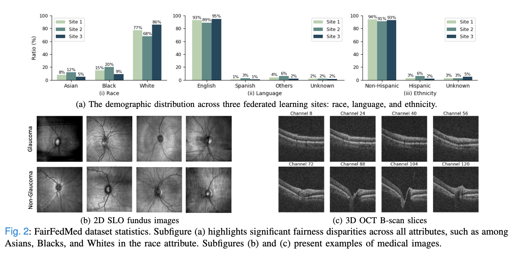
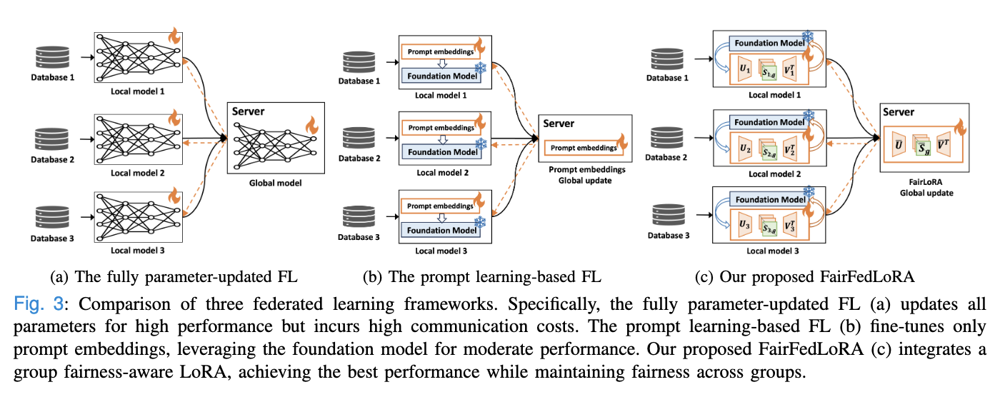
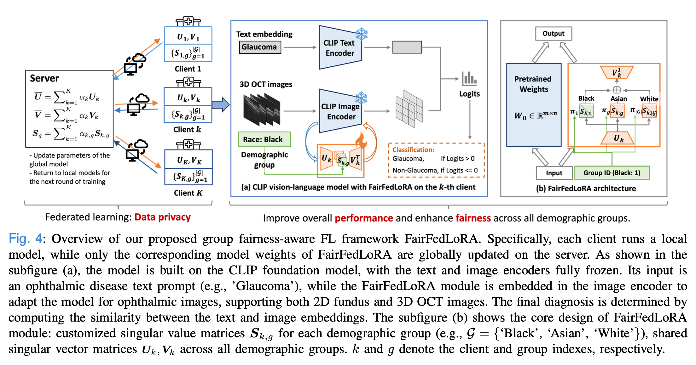
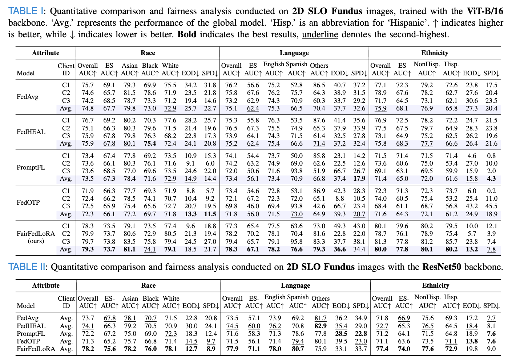
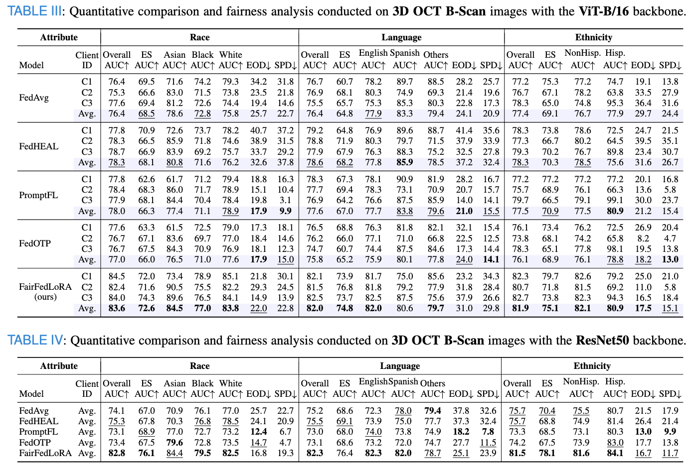

# FairFedMed: Benchmarking Group Fairness in Federated Medical Imaging with FairLoRA
<p align="center">
  <a href="https://arxiv.org/abs/2508.00873"><strong>Paper</strong></a> ·
  <a href="[https://arxiv.org/abs/2508.00873](https://drive.google.com/open?id=11SrLJQdKwA3ELEnebTzlmZGadcxnGIiv&usp=drive_fs)"><strong>Dataset</strong></a> 
</p>

## Dataset [FairFedMed](https://drive.google.com/open?id=11SrLJQdKwA3ELEnebTzlmZGadcxnGIiv&usp=drive_fs)

You can download [FairFedMed](https://drive.google.com/open?id=11SrLJQdKwA3ELEnebTzlmZGadcxnGIiv&usp=drive_fs) dataset (56GB) from our official [Google Drive](https://drive.google.com/open?id=11SrLJQdKwA3ELEnebTzlmZGadcxnGIiv&usp=drive_fs). It consists of paired 2D SLO fundus images and 3D OCT B-Scans from 15,165 patients for glaucoma detection, along with six different demographic attributes: age, gender, race, ethnicity, preferred language, and
marital status.

### Data format
**Dataset structure:**
```json
DATA/
  ├── fairfedmed/
  │   ├── all  # a dir that stores all raw data files
  │   │   ├──filename1.npz 
  │   │   ├──filename2.npz 
  │   │   └── ...
  │   ├── meta_all.csv
  │   ├── meta_site{k}_language_train.csv
  │   ├── meta_site{k}_language_test.csv
  │   ├── meta_site{k}_language.csv
  │   ├── meta_site{k}_race_train.csv
  │   ├── meta_site{k}_race_test.csv
  │   ├── meta_site{k}_race.csv
  │   ├── meta_site{k}_ethnicity_train.csv
  │   ├── meta_site{k}_ethnicity_test.csv
  │   ├── meta_site{k}_ethnicity.csv
  │   └── ...
```

### Dataset Attributes and Group Distribution
The dataset includes train and test samples for each group.

Format: Group Name: [Number of Train Samples, Number of Test Samples]

  - **Race**: [Asian, Black, White]
    - Site1: {Asian: [335, 69], Black: [625, 133], White: [3083, 809]}
    - Site2: {Asian: [515, 91], Black: [813, 198], White: [2715, 722]}
    - Site3: {Asian: [229, 39], Black: [379, 83], White: [3437, 890]}
  - **Language**: [English, Spanish, Others, Unkown]
    - Site1: {English: [3765, 936], Spanish: [35, 15], Others: [164, 38], Unknown: [79, 22]}
    - Site2: {English: [3609, 889], Spanish: [118, 33], Others: [234, 69], Unknown: [81, 20]}
    - Site3: {English: [3865, 964], Spanish: [37, 10], Others: [83, 19], Unknown: [61, 19]}
  - **Ethnicity**: [Non-hispanic, Hispanic, Unkown]
    - Site1: {Non-hispanic: [3814, 937], Hispanic: [121, 30], Unkown: [107, 44]}
    - Site2: {Non-hispanic: [3684, 916], Hispanic: [248, 55], Unkown: [111, 40]}
    - Site3: {Non-hispanic: [3776, 938], Hispanic: [88, 22], Unkown: [182, 52]} 



## Methodology [(FairLoRA)](trainers/GLP_OT_SVLoRA.py)
Comparison of three federated learning pipelines: (a) the fully parameter-updated FL, (b) the prompt learning-based FL, and (c) our proposed FairLoRA.


Overview of our proposed FairLoRA, a group fairness-aware federated learning model. 



### [Model Training](scripts/fairfedlora_fairfedmed.sh)
Download the above dataset first, then run the following code:
```
# 2D SLO images
sh scripts/fairfedlora_fairfedmed.sh       # ViT-B/16 backbone
sh scripts/fairfedlora_fairfedmed_rn50.sh  # ResNet50 backbone
# 3D OCT B-Scan images
sh scripts/fairfedlora_fairfedmed_oct.sh       # ViT-B/16 backbone
sh scripts/fairfedlora_fairfedmed_oct_rn50.sh  # ResNet50 backbone
```

### [Evaluation Metrics](evaluation/evaluator_oph.py)
 - AUC
 - ESAUC
 - Group-wise AUC
 - EOD
 - SPD

### Experimental Results

We compare FairLoRA with traditional fully parameter-updated methods, including [FedAvg](https://arxiv.org/pdf/2104.11375) and [FedHEAL](https://github.com/yuhangchen0/FedHEAL), as well as prompt learning-based models, such as [PromptFL](https://github.com/PEILab-Federated-Learning/PromptFL) and [FedOTP](https://github.com/HongxiaLee/FedOTP), both based on [CLIP](https://github.com/openai/CLIP). 

In summary, the experimental results highlight the effectiveness of FairLoRA in improving both performance and fairness compared to existing FL models. While traditional fully parameter-updated FL methods achieve strong overall accuracy, they fail to ensure fairness across diverse demographic groups. Prompt-learning-based FL models show improved fairness but suffer from a decline in performance due to limitations in adapting to medical imaging data. FairLoRA, on the other hand, strikes a balance between high classification performance and enhanced fairness across race, language, and ethnicity attributes. This makes it a promising approach for ensuring both high accuracy and equitable outcomes in fairness-aware medical FL tasks.





## Acknowledge
This code is partially derived from the [FedOTP](https://github.com/HongxiaLee/FedOTP) and [DASSL](https://github.com/KaiyangZhou/Dassl.pytorch) frameworks. Thanks!
